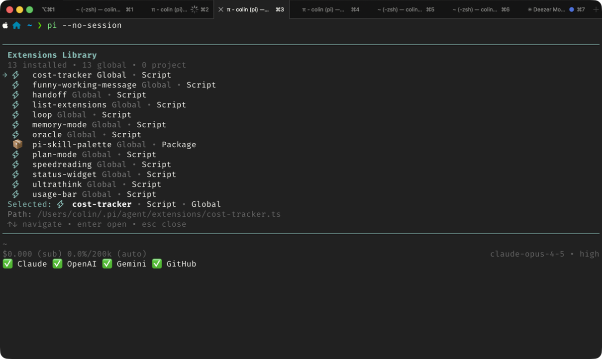

# pi-list-extensions

`/extensions` command for pi. Browse, enable/disable, and open extensions in your editor.



## Install

```bash
ln -s /path/to/list-extensions.ts ~/.pi/agent/extensions/
```

## Usage

```
/extensions
```

## Keys

- `↑↓` navigate
- `Enter` open in editor
- `d` enable/disable extension
- `Esc` close

## Features

The extension library shows all installed extensions from both global (`~/.pi/agent/extensions/`) and project (`.pi/extensions/`) scopes. Disabled extensions appear greyed out at the bottom of the list.

Toggling an extension writes to `settings.json` using Pi's standard exclusion format. You'll need to restart Pi for changes to take effect.
